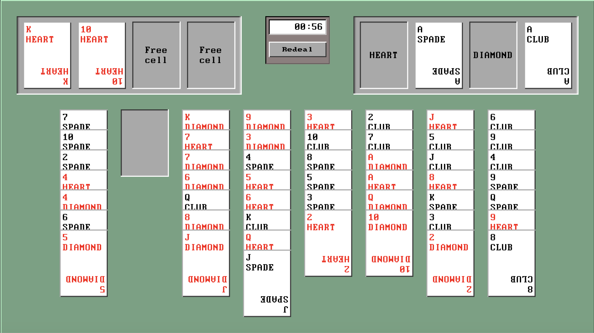

# Freecell
Solitare game make in Unity, based on the game from Microsoft Windows 
https://en.wikipedia.org/wiki/FreeCell

## About
Built for a technical assessment. Code, prefabs, scenes and sounds were built by me within 24 hours, except:
* Box sprites, fonts and the button UI element from my own asset store package https://assetstore.unity.com/packages/2d/gui/90-s-desktop-os-ui-159547, in  `Assets/Desktop90_UI`
* SimpleJSON https://github.com/Bunny83/SimpleJSON, in `Assets/SimpleJSON`

## Dev setup
* Clone the repo
* Open the project in Unity

## Compatibility
Built with Unity 2018.4.13f1

## Configuration
The game can be configured from the file `Assets/Configuration/config.json`. Available variables are:
* EnabledHoverColor: Hex color.The color a card highlights when dragging a card that can be placed on top of it
* DisabledHoverColor: Hex color. The color a card highlights wheb dragging a card that cannot be place on top of it
* CheatsEnabled: true/false. When true, pressing the 'A' key triggers the end of the game. Also when true, you can pick up card from anywhere in the columns.
* RNGSeed: integer. The seed for the random number generator for shuffling the cards.

## Code overview
The programming of the game centers around the idea that PlayingCard objects are always attached to some anchor object. Anchors are things on screen where a card can be placed (in a column, foundation space, or free cell). The class CardAnchor.cs contains the main anchor behavior, and then the decendent classes implement specific behavior for the foundation, column and freecell spaces.
